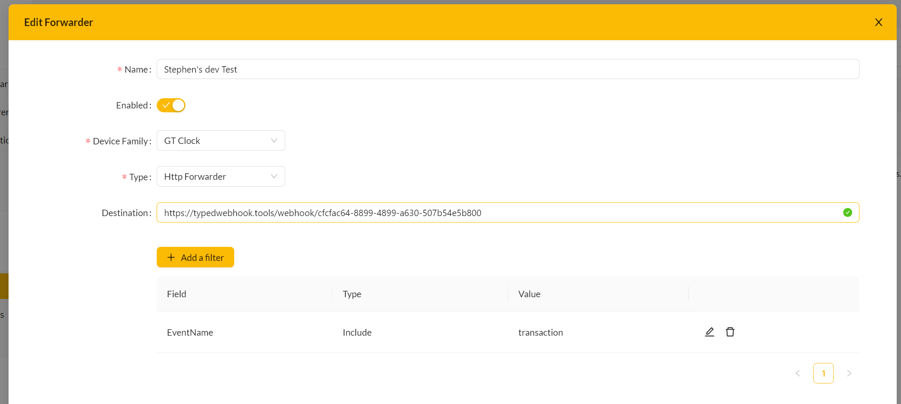
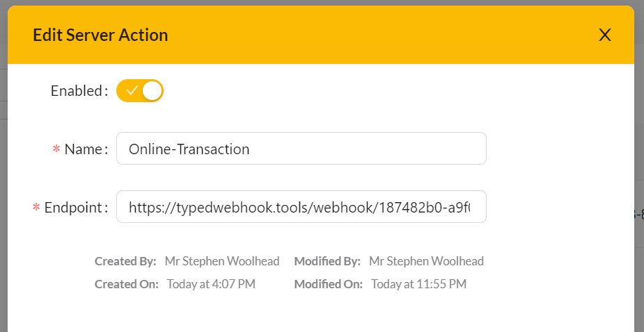
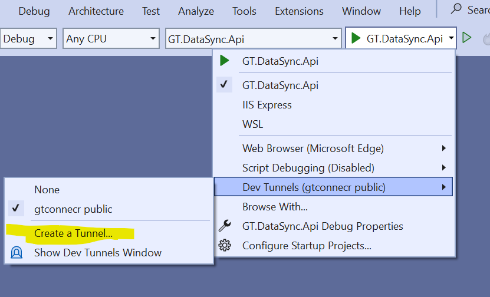
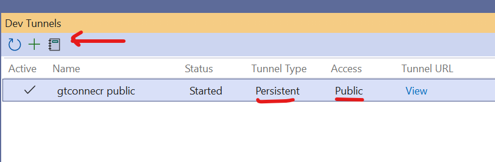

# Transaction Routing

There are several options for sending transactions to a third party system, they can be grouped into the following two main use cases:

## Offline Transactions

The forward system is designed to provide a buffered way to transfer a transaction to a third party.  This method should be used when the transaction can be submitted at the clock without the need for the clock to display any realtime response fom the third party system.  This can provide protection for the following issues:
 - The clock is offline, the transaction is held at the clock until it can establish a connection to GtConnect.
 - The third party is offline, in which case the transaction will be buffered in GtConnect until it can be successfully delivered.

 When configuring the clocking method in the clocks buttons file, use the **ws.clocking** action. See the EasyClock reference manual for details.
 
### Available transports for Forwarders
 - HTTP webhook - The transaction will be delivered over the HTTPS.
 - Azure Service Bus - The transactions will be queued into an Azure Service Bus provided by the third party.  Details on service bus can be found here: https://azure.microsoft.com/en-gb/products/service-bus


### Testing transaction delivery via HTTP

To initially check how transactions look, we recommend using a site like https://typedwebhook.tools/ 

## Online Transactions

The Server Actions system is designed to provide RPC style processing of transactions, where when the transaction is submitted, a real time call is made through the GtConnect infrastructure to the third party, which then decides if to accept or reject the transaction which it then communicates back to the clock in it's response; the clock also returns a message that will be displayed to the user.  If the clock can not communicate through to the third party, it can be configured to either forward the transaction via the offline method or block the user from clocking.

When configuring the clocking method in the clocks buttons file, use the **ws.clocking.online** action. See the EasyClock reference manual for details.

The only transport currently available for delivery of transactions via the online server action method is HTTP.


## Forwarded Messages

Forwarders can be configured on any node, they will capture transactions from any devices on that node or lower.  We recommend single higher level forwarders rather lots of lower level forwarders, where feasible. If multiple forwarders are defined that capture a device, the messages for that device will be duplicated across all valid forwarders.

It's possible to define a filter for the **event type** of messages to be forwarded.  Currently the types of messages that can be forwarded are:
 - **transaction** : A transaction received from the device
 - **device-connection-update** : Notification that we have received a heartbeat from the device.
 - **device-app-status-update** : Notification that our monitored online application state of a device has changed.

If the filter is not defined, all messages will be forwarded.

For the Service Bus transport the destination should be a connection string generated for a specific queue.  The SAS policy used should contain only send permissions.

For the HTTP transport, the destination should be the full URL needed to deliver a message.  The URL is used as, including all query string components.

### Transaction

Offline transactions will be delivered with a one way call to a web hook.  The server should return a success code 200, 201 or 204 to tell GtConnect that the message can be marked as processed.  If the returns another code the message will be requeued for delivery till successful or the message times out.



This will capture a transaction with the following format

```json
{
    "messageId": "33e97178-0594-4f5b-ba4a-a3c3f9f12d8e",
    "correlationId": "3efb6e81-6aad-4363-892d-fd972db4587b",
    "previousMessageId": null,
    "timestamp": "2023-07-29T00:05:06+01:00",
    "entity": "FP-GT8-WH~0101007626",
    "eventName": "transaction",
    "contents": {
        "data": "<?xml version=\"1.0\" encoding=\"utf-16\"?>\n<transaction>\n <transID>02e07a24-7242-4856-b08d-9246e990025d</transID>\n <deviceID>FP-GT8-WH~0101007626</deviceID>\n <employee>\n <empID>44825e03-7e23-42bf-4cfc-08da0b3f08ae</empID>\n <identifiedBy>\n <face>44825e03-7e23-42bf-4cfc-08da0b3f08ae</face>\n </identifiedBy>\n <verifiedBy>\n <none />\n </verifiedBy>\n </employee>\n <data>\n <clocking>\n <time>2023-07-29T00:05:06+0100</time>\n <type>in</type>\n </clocking>\n </data>\n</transaction>"
    }
}
```

### device-connection-update

> IMPORTANT: Device status messages are deprecated and will be remove in a future version. 

A device status update message has the format below:

```json
{
    "messageId": "0b0a966f-ea72-4ae7-8b80-de9d18cf00c1",
    "entity": "fb33beab-7fe7-45b5-84be-8a5a0c90e31b",
    "eventName": "device-connection-update",
    "lastConnected": "2023-09-18T14:38:03.1692877+00:00"
}
```

### device-app-status-update

A device status update message has the format below:

```json
{
    "messageId": "0b0a966f-ea72-4ae7-8b80-de9d18cf00c1",
    "entity": "fb33beab-7fe7-45b5-84be-8a5a0c90e31b",
    "eventName": "device-app-status-update",
    "lastConnected": "2023-09-18T14:38:03.1692877+00:00",
    "serialNumber": "FP-GT8~00001234",
    "status": "online" 
}
```

In this message:
 - entity : The GtConnect ID for the device
 - serialNumber : The devices serial number
 - status: The updated status of the device, this can be online or offline. 

## Server action online transaction

An online request is made synchronously, the server must respond to the clock with a response in real time.  If the server responds with anything else other than a valid 200 response a failure message will be sent to the clock.



A sample of the message posted (the request content will be application/xml)

```xml
<interface>
    <action>Online-Transaction</action>
    <requestedOn>07/28/2023 22:58:49 +00:00</requestedOn>
    <requestType>POST</requestType>
    <payload>&lt;?xml version="1.0" encoding="utf-16"?&gt; &lt;transaction&gt; &lt;transID&gt;641e1e71-3cb8-427c-b439-cdbb5f303ef8&lt;/transID&gt; &lt;deviceID&gt;FP-GT8-WH~0101007739&lt;/deviceID&gt; &lt;employee&gt; &lt;empID&gt;{{employeeId}}&lt;/empID&gt; &lt;identifiedBy&gt; &lt;keypadID&gt;6141016&lt;/keypadID&gt; &lt;/identifiedBy&gt; &lt;verifiedBy&gt; &lt;pin&gt;12345&lt;/pin&gt; &lt;/verifiedBy&gt; &lt;/employee&gt; &lt;data&gt; &lt;clocking&gt; &lt;time&gt;2023-06-19T20:47:09&lt;/time&gt; &lt;type&gt;in&lt;/type&gt; &lt;jobCodes&gt; &lt;jobCode&gt; &lt;jobcodeId&gt;6873&lt;/jobcodeId&gt; &lt;jobCategoryId&gt;a&lt;/jobCategoryId&gt; &lt;/jobCode&gt; &lt;/jobCodes&gt; &lt;/clocking&gt; &lt;/data&gt; &lt;/transaction&gt;</payload>
    <sourceDeviceSerial>FP-GT8-WH~0101007739</sourceDeviceSerial>
    <sourceDeviceId>7f47d1ef-fb30-4552-84c4-014e2ed6bc13</sourceDeviceId>
    <tenantId>54458dda-ca3d-450b-9467-92a881a75539</tenantId>
</interface>
```

The response returned to the clock should again be XML

```xml
<response failed="false">
    <message>Thank you for your clocking!</message>
</response>
```

> To see an example of this flow in action, you can point the server action to our test server, this 
> will accept any transaction you you send to it, and can be used for verifying the process from the clock 
> to target server, before embarking on developing your own endpoint :
> https://datasync-api-demo.azurewebsites.net/bogus/transaction/online

## Testing with Visual Studio Dev Tunnels

The easiest way to test is to run our sample and set up Visual Studio dev tunnel, this
will give you a public endpoint that GtConnect can be pointed two.



When you create the tunnel, create it as persistent (this will mean the URL will stay the same) and public will mean that there is no extra authentication needed.



You can the click the button in the top left that will show your the URL it's created for you, this will give you a URL like this:

https://kxmnwtt0-7020.uks1.devtunnels.ms/

With this sample app, use this url for the forwarder for offline:

https://kxmnwtt0-7020.uks1.devtunnels.ms/api/transactions/offline

And for the server action based online transactions 

https://kxmnwtt0-7020.uks1.devtunnels.ms/api/transactions/online